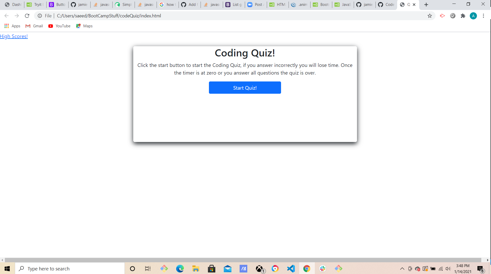

### Week 4 assignment:  codeQuiz

This weeks task set us on a mission to create a timed coding quiz with multiple choice questions, along with being able to input a list of highscores and initials of users.  As per usual the assignment also requires us to launch it with an URL and have no errors in the code.  We needed to have a clear and responsive interface as well.  I broke this weeks assignment into sections and using "Google-Fu" I found solutions to each objective I was trying to tackle.  Using some bootstrap, CSS, and Javascript I created a five question coding quiz.  

### Code Breakdown

I used bootstrap to set up my html page using a container and a jumbotron and some extra css to create it look like a card to the user.  I created another html file for highscores as well because I saw there was a link to it on the demo.  For this page I also used the same bootstrap model.  I then started my Javascript for the landing page.  I created an array of questions and answers with the correct answer as an answer key, then looped that array through the created elements in Java.  Then I set up a scoring system along with storage conditions which allowed me to create the high score page.  Using addEventListener, event target, creating and appending elements, and using local storage I was able to create the timed quiz to meet all the criteria in the assignment.  I had some trouble making it look as good as I wanted too.  I cannot get my buttons to go into a list form and my high score list is just basic and could use a better look.  I used code examples online to link the two pages and score list.  I couldn't get it to work but when I targeted the element with its class instead of id everything fell into place.  

### Links 

[Link to Timed Code Quiz](https://haru2727.github.io/passwordGenHW3/)

